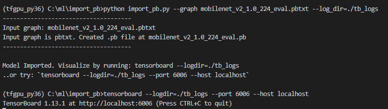

# Import .pb or .pbtxt graph files into TensorBoard for viewing

It can sometimes be useful to view a TensorFlow graph file with TensorBoard. The script in this repository will import a graph file which is in either binary (.pb) or text (.pbtxt) format into TensorBoard.

### Current Status
This script has undergone limited testing - any issues or suggestions, please email me directly: mark.harvey@xilinx.com

## 1. Instructions

Clone or download this repository. The import_pb.py script can be copied to anywhere in your system.

## 2. Usage

The import_pb.py script has 2 command line arguments:

| Argument              | Type    | Default value                   | Description                                            |  
| --------------------- | --------|:-------------------------------:| -------------------------------------------------------|  
| `--graph`   or `-g`   | string  | None - must be supplied by user | Name of the graph file, must have .pb or .pbtxt suffix |  
| `--log_dir` or `-l`   | string  | tb_log                          | Name of folder for TensorBoard data                    |  

:warning: The script does not check to see if the folder specified with the `--log_dir` option already exists or if it contains any data. It will just simple write TensorBoard data directly into the folder. 

Example command lines:

Import a binary format graph, TensorBoard data directory is default: 
`python import_pb.py --graph ./train/infer_graph.pb`

Import a text format graph, TensorBoard data directory is ./files/tb/data: 
`python import_pb.py -g ./train/infer_graph.pbtxt  -l ./files/tb/data`

When the script has completed, it will prompt you with tensorboard command line that needs to be run. Once you have run the tensorboard command, open a web browser and paste the URL into the search bar. TensorBoard will then open and display the graph.

If the input graph file specified with the `--graph` is in text format (.pbtxt) then the script will first create a binary format graph (.pb) file. This file will remain on disk after the script has exited.

